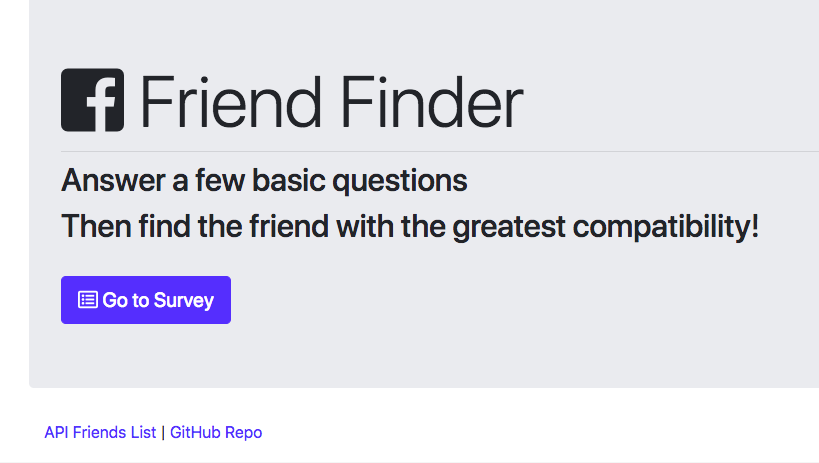
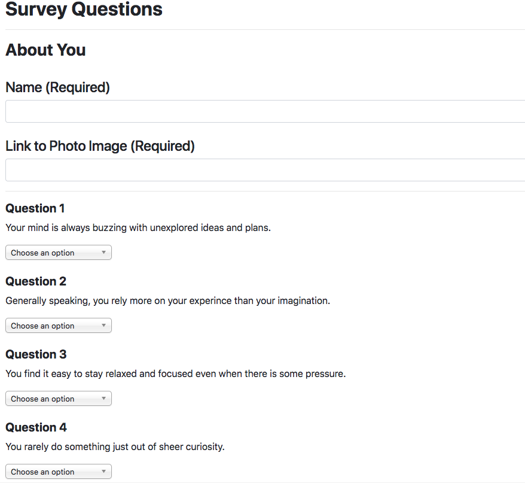
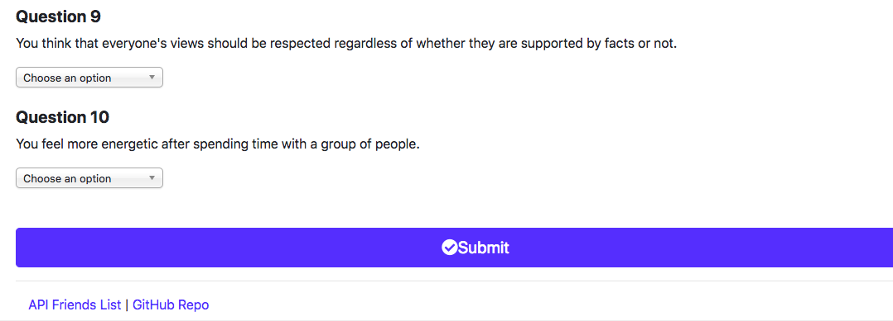
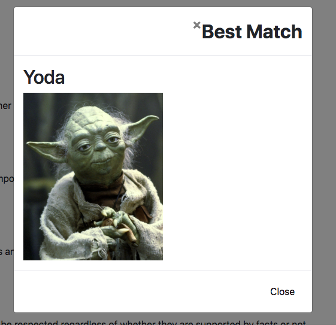
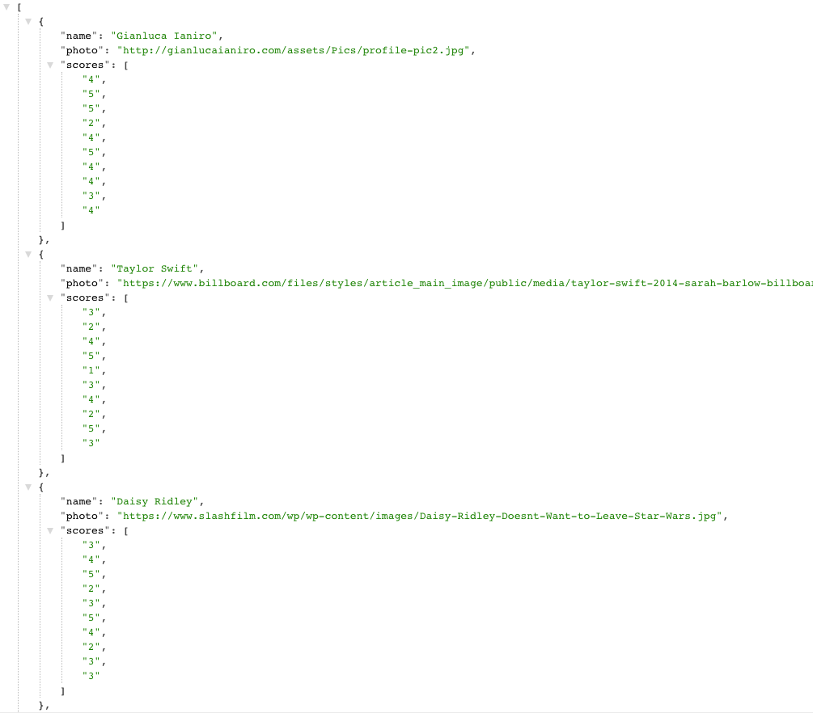

# compatibility-application

## What the application does

The compatibility application is a full stack application. Takes in infomation from the user and finds a compatabile match (fiend mach) from the database.

## Main Function

The application displays a surey to the user. The survey is composed of 10 questions plus the users name and photo. Once submitted the application will then compare the user's answers with those from other users. The app will then display the name and picture of the the user with the best overall match. The users information is stored in our object.

## NPM Node Pacakes Manager libraries used

The following npm libraries are used and will need to be installed for the application to work
npm install express
npm install body-parser
npm install path

## Getting Started

To run application on local machine without going to website. Once the repo is cloned you will need to run the following command in the terminal:
1- npm init
2- npm install
3- npm install express (https://www.npmjs.com/package/express
4- npm install body parser (https://www.npmjs.com/package/body-parser)
5- npm install path (https://www.npmjs.com/package/path)
6- node server.js (this will run the application.)
7- open your web browser and go to http://localhost:8080/ which 8080 is the port the pplication is listening to
8- you can then use the application by following all the prompts on the screen (complete the survey)
9- type 'Control + C" to end connection to database and stop program.

## Functions Explained and Screen Shots

after running node server.js and going to http://localhost:8080/ the following occur:
1- Displays the following landing page to the screen:

     

2- If you click on got to survey the survey displays on the screen as shown on the following screen shot.

     
     
     

3- Once you complete the survey and place the submit button. A match is displayed on the screen based on your scores and the current firends in the database. Note you information is stored on the server.

     

4- At the bottom of every page there is two links one is the API Friends List which displays all the freinds on the server in JSON. The other brings you to my GitHub Repo

     

